# Caterpillar Vision AI — Inspection Platform

**AI-powered equipment inspection platform with real-time analytics, automated reporting, and an intelligent chatbot assistant.**

Caterpillar Vision AI (Catvision) combines wearable-ready AI vision, detailed analytics, and natural-language assistance to transform how teams conduct equipment inspections. Inspectors get checklist results, severity heatmaps, parts recommendations, executive summaries, and similar-issue detection—all in one dashboard with optional live AI vision and document analysis.

---

## Table of Contents

- [Overview](#overview)
- [Screenshots](#screenshots)
- [Features & Functionality](#features--functionality)
- [Tech Stack](#tech-stack)
- [Project Structure](#project-structure)
- [Setup & Installation](#setup--installation)
- [API Overview](#api-overview)
- [Environment Variables](#environment-variables)
- [License](#license)

---

## Overview

Caterpillar Vision AI is a full-stack web application for **equipment inspection management** and **AI-assisted analysis**. It provides:

- **Landing page** — Value proposition, analytics preview, and AI agent demo for the Caterpillar Vision AI platform.
- **Dashboard** — Recent inspections, asset details, status (Pass/Fail/Monitor), report access, and high-level analytics (top failure categories, inspection volume, outcome distribution).
- **Inspection detail** — Checklist results, severity, evidence, AI-recommended actions, confidence scores, media gallery, parts recommendations, executive summary, and similar-issue detection.
- **Analytics** — Category drill-down (e.g. Hydraulics), trends over time, checklist breakdown by component, and global/regional severity heatmaps.
- **AI features** — Chatbot (inspection + PDF summarization), optional live vision analysis (camera), TTS/STT, and AI-generated issue resolution details.

The app is built with a **React (Create React App + Craco)** frontend and a **FastAPI** backend. Inspections and analytics can run on **mock/in-memory data** for demos; persistence can be extended via MongoDB or other stores.

---


### 1. Landing Page

Modern landing page for the Caterpillar Vision AI platform showcasing the core value proposition: AI-powered equipment inspections with real-time analytics and automated reporting. The design emphasizes safety, efficiency, and seamless integration with inspection workflows.

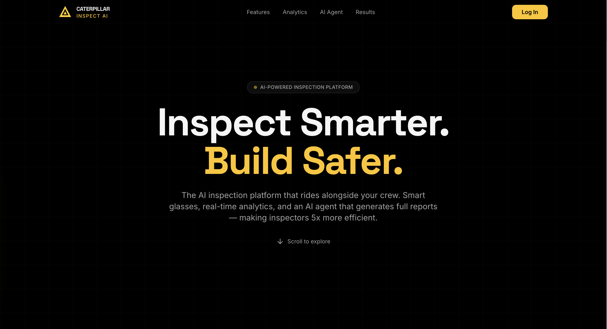

### 2. Dashboard Overview

Main dashboard displaying recent equipment inspections, including asset details, status (Pass/Fail/Monitor), and report access. It also provides high-level analytics such as top failure categories, inspection volume trends, and outcome distribution.

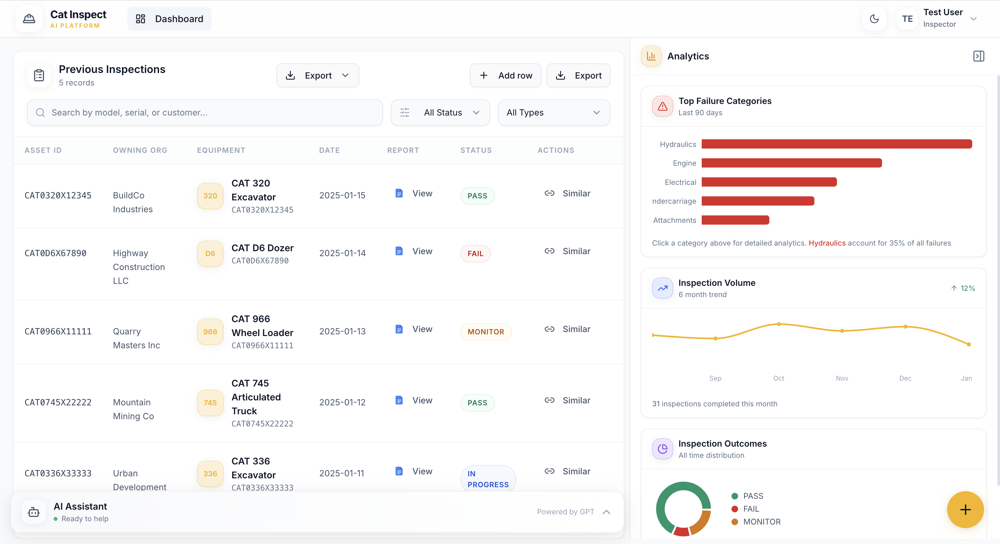

### 3. Hydraulics Detailed Analytics

Detailed analytics view for a specific failure category, showing total failures, trends over time, and checklist breakdown by component. This helps teams identify common failure points and prioritize maintenance actions.

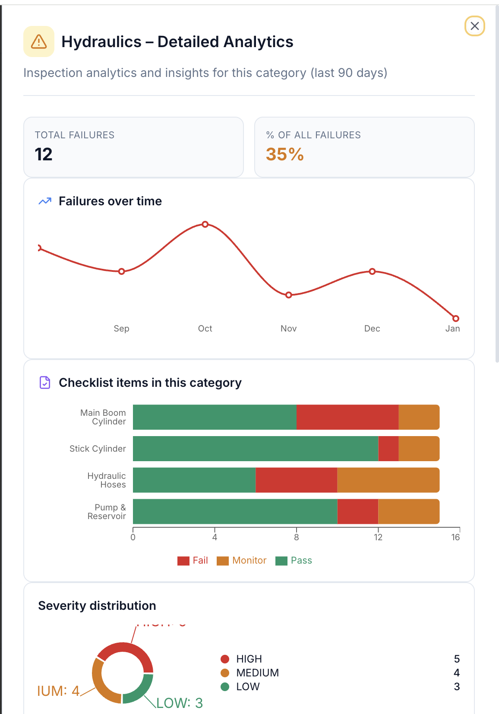

### 4. Global Severity Distribution

Global heatmap visualizing inspection severity distribution across regions to highlight geographic risk patterns. The dashboard also surfaces recommended maintenance actions and recent critical inspection findings.

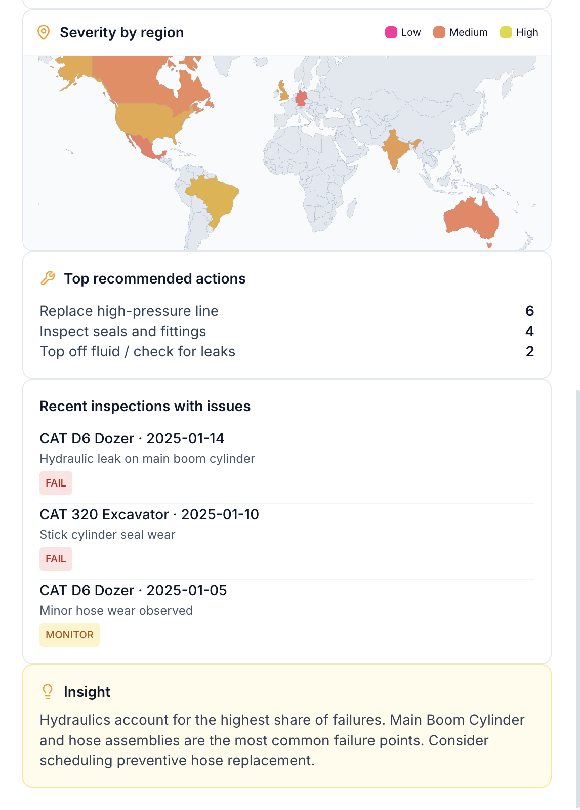

### 5. U.S. Regional Drill-Down

State-level drill-down view enabling deeper analysis of inspection severity within the United States. This allows fleet managers to identify localized issues and allocate maintenance resources strategically.

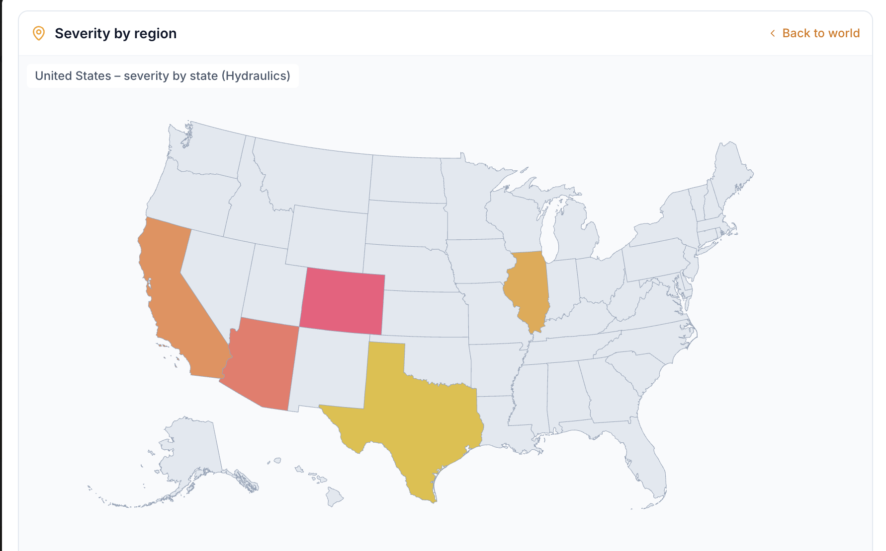

### 6. Inspection Checklist Results

Comprehensive checklist view showing inspection results for each component, including pass/fail status, severity level, evidence, and AI-recommended actions. Confidence scores provide transparency into AI-generated recommendations.

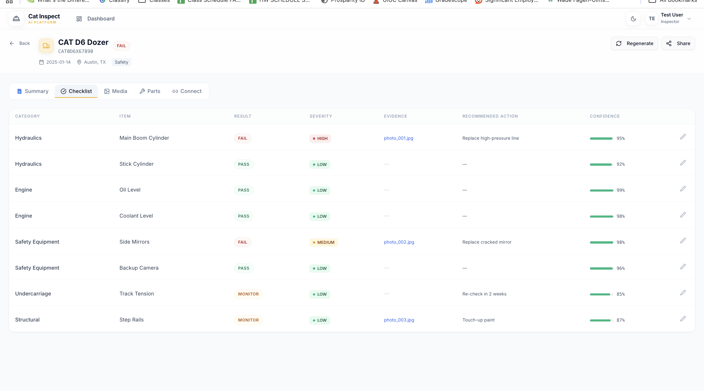

### 7. Parts Recommendation System

AI-powered parts recommendation interface suggesting replacement components with fitment certainty scores. This enables inspectors to quickly order correct parts and streamline repair workflows.

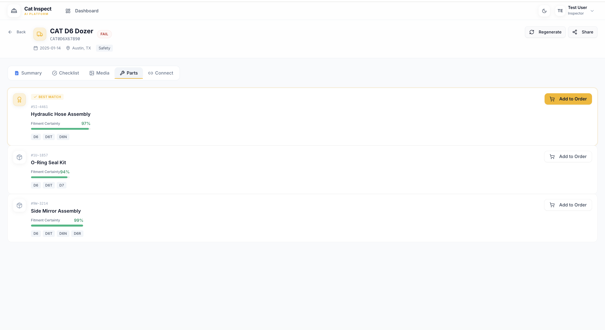

### 8. Executive Summary Report

Automatically generated inspection summary highlighting key findings, maintenance recommendations, and safety insights. This provides stakeholders with a clear overview of equipment condition and required actions.

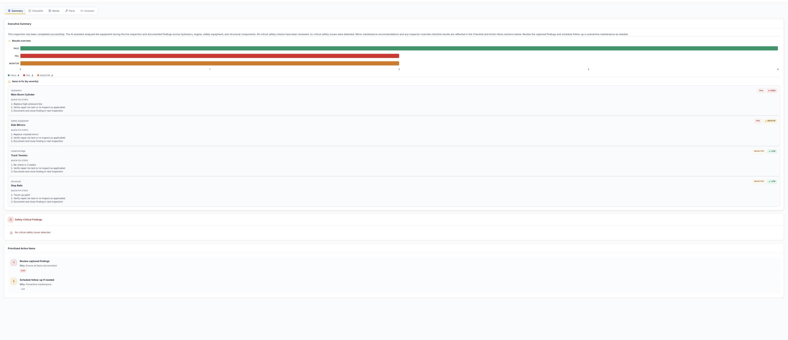

### 9. Similar Issue Detection

AI-driven similarity detection showing related past inspection issues across equipment. This helps teams identify recurring problems and improve preventive maintenance planning.

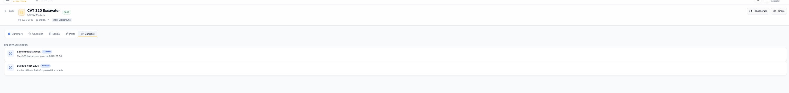

### 10. AI-Generated Issue Resolution Details

Detailed report explaining detected issues, root causes, and step-by-step resolution actions taken. This creates a complete audit trail and supports operational transparency and compliance.

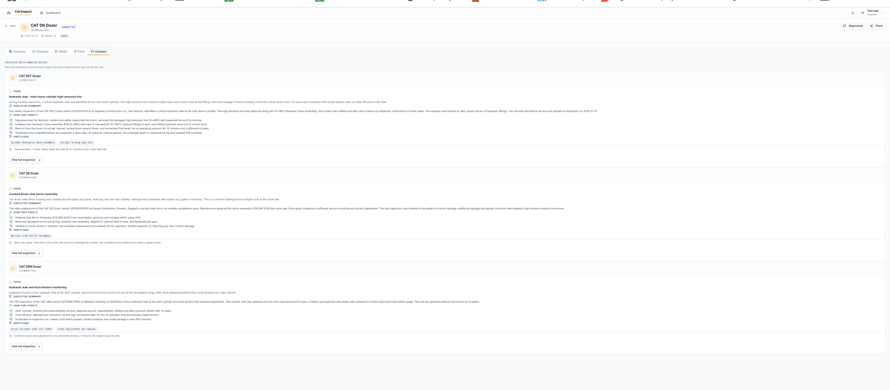

### 11. AI Chatbot Agent

The in-app AI assistant supports inspection-related questions, failure summaries, chart generation, and document (PDF) upload for summarization and insights. It is available from the dashboard and other authenticated views.

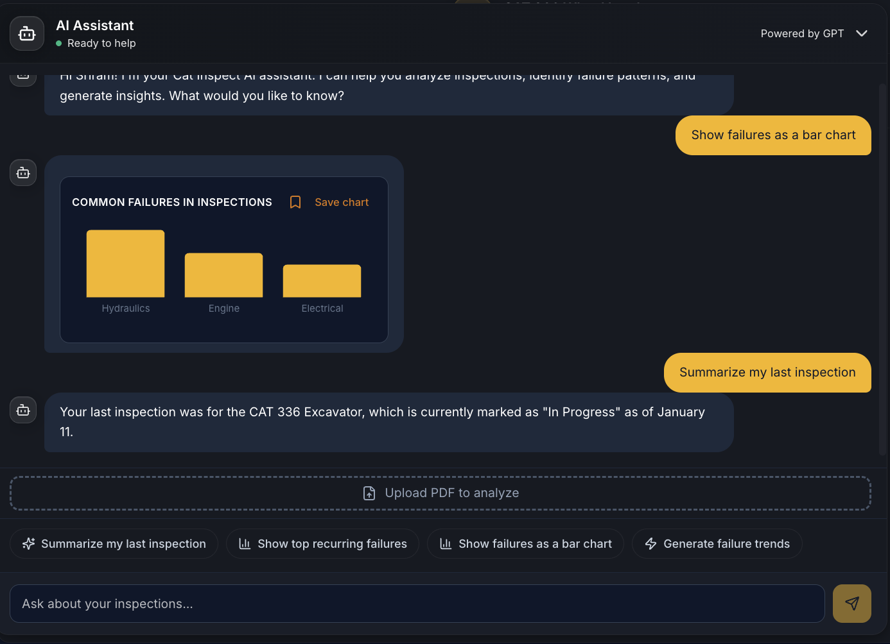

---

## Features & Functionality

### Landing & Marketing

- **Landing page** — Hero, features, analytics preview, AI agent section, stats, and CTA with demo login.
- **Branding** — Caterpillar Vision AI (CATERPILLAR + VISION AI) in navbar and footer.
- **Auth** — Simple name-based “Log In” for demo; redirects authenticated users to the dashboard.

### Dashboard

- **Inspection table** — List of inspections with search, filters (status, type), and “Add row” to create new inspections.
- **Columns** — Asset (model, serial), customer, location, type, status, date, inspector, summary, safety findings, action items, report link.
- **Analytics sidebar** — Top failure categories, inspection volume trends, outcome distribution; charts can be saved to the sidebar.
- **Export** — CSV/Excel export for inspections and analytics; per-inspection PDF export.

### Inspection Detail

- **Summary** — Executive summary, key findings, maintenance recommendations, safety insights.
- **Checklist** — Per-component results with pass/fail, severity, evidence, AI-recommended actions, and confidence scores.
- **Media** — Gallery of inspection photos/attachments.
- **Parts recommendations** — AI-suggested replacement parts with fitment certainty.
- **Similar issues** — Related past inspections to spot recurring problems.
- **Issue resolution** — AI-generated details on issues, root causes, and resolution steps for audit and compliance.
- **Regenerate report** — Trigger regeneration of summary/report content.

### Analytics

- **Overview** — Aggregated analytics (failure categories, trends, pass/fail/monitor).
- **Category drill-down** — e.g. Hydraulics: total failures, trends over time, checklist breakdown by component.
- **Severity heatmaps** — Global and U.S. regional severity distribution for geographic risk and resource allocation.
- **Charts** — Bar charts, trends, and breakdowns (Recharts); export/save charts from chatbot.

### AI & Integrations

- **Chatbot** — Text chat with context from inspection data and/or uploaded PDFs; summarization, key insights, risks, action items; optional chart generation (bar) in response.
- **Document upload** — PDF upload per session; text extraction and truncation for rate-limit safety; clear document and replace.
- **Vision (optional)** — Camera/image analysis endpoint for equipment issues (e.g. GPT-4o Vision); usable from live inspection flows.
- **TTS / STT** — Text-to-speech and speech-to-text endpoints for voice-driven workflows.
- **Rate-limit handling** — Document analysis returns a clear 429 message and suggests waiting or asking for a shorter summary.

### Live Inspection (Optional)

- **Live inspection flow** — Guided inspection with optional AI vision and real-time findings timeline.
- **Findings timeline** — Live list of findings as the inspection progresses.

---

## Tech Stack

| Layer    | Technology |
|---------|------------|
| Frontend | React 19, React Router 7, Craco, Tailwind CSS, Radix UI, Recharts, Axios, Lucide icons |
| Backend  | Python 3, FastAPI, Uvicorn, Pydantic |
| AI      | OpenAI API (GPT-4o-mini default for chat/vision), optional TTS/STT |
| Data    | In-memory (mock inspections + created inspections); optional MongoDB (env) |
| Export  | PDF (reportlab), CSV/Excel (openpyxl, csv), PyPDF for document text extraction |

### Frontend Scripts

- `yarn start` / `npm run start` — Development server (e.g. port 3000).
- `yarn build` / `npm run build` — Production build.

### Backend

- **Server** — `uvicorn server:app --reload --host 0.0.0.0 --port 8000` (run from `backend/`).
- **API prefix** — `/api` (e.g. `/api/inspections`, `/api/chat`).

---

## Project Structure

```
├── backend/
│   ├── server.py          # FastAPI app: inspections, analytics, chat, documents, AI vision, TTS/STT, export
│   ├── requirements.txt   # Python dependencies
│   └── .env               # MONGO_URL, DB_NAME, OPENAI_API_KEY, CORS_ORIGINS, etc.
├── frontend/
│   ├── src/
│   │   ├── components/    # UI: landing, dashboard, inspection detail, chatbot, analytics, heatmaps, etc.
│   │   ├── pages/         # Landing, Dashboard, InspectionDetail, LiveInspection, NewInspection
│   │   ├── context/       # AuthContext (demo auth)
│   │   └── config.js      # API_URL
│   ├── package.json
│   └── .env               # REACT_APP_BACKEND_URL
├── Pictures/              # Screenshots for README (landing, dashboard, analytics, checklist, parts, report, similar issues, resolution, chatbot)
└── README.md              # This file
```

---

## Setup & Installation

### Prerequisites

- Node.js 18+ and Yarn (or npm)
- Python 3.10+
- Optional: MongoDB (if you switch from in-memory to DB-backed storage)
- OpenAI API key for chat, document analysis, and optional vision/TTS/STT

### Backend

```bash
cd backend
python -m venv .venv
source .venv/bin/activate   # Windows: .venv\Scripts\activate
pip install -r requirements.txt
```

Create `backend/.env` (see [Environment Variables](#environment-variables)), then:

```bash
uvicorn server:app --reload --host 0.0.0.0 --port 8000
```

### Frontend

```bash
cd frontend
yarn install
```

Create `frontend/.env` with `REACT_APP_BACKEND_URL=http://localhost:8000`, then:

```bash
yarn start
```

Open `http://localhost:3000`. Use the landing “Log In” (any name) to reach the dashboard.

---

## API Overview

| Method | Endpoint | Description |
|--------|----------|-------------|
| GET    | `/api/` | Health/info |
| GET    | `/api/inspections` | List inspections (optional: status, inspection_type, search) |
| GET    | `/api/inspections/{id}` | Inspection detail (summary, checklist, media, parts, similar issues) |
| POST   | `/api/inspections` | Create inspection |
| PUT    | `/api/inspections/{id}/checklist/{item_id}` | Update checklist item result |
| POST   | `/api/inspections/{id}/finish` | Finish inspection and generate report |
| GET    | `/api/analytics` | Aggregated analytics |
| GET    | `/api/analytics/category/{category}` | Category drill-down (e.g. Hydraulics) |
| GET    | `/api/export/inspection/{id}/pdf` | Export inspection as PDF |
| GET    | `/api/export/all` | Export all as CSV |
| GET    | `/api/export/all/excel` | Export all as Excel |
| POST   | `/api/documents/upload` | Upload PDF for chatbot context |
| DELETE | `/api/documents` | Clear uploaded document (session) |
| GET    | `/api/documents/context` | Get current document context (filename, char count) |
| POST   | `/api/chat` | Chat (inspection + optional document context); returns text and optional chart_data |
| POST   | `/api/ai/vision/analyze` | Analyze image (base64) for equipment issues |
| POST   | `/api/ai/tts` | Text to speech |
| POST   | `/api/ai/stt` | Speech to text |
| POST   | `/api/inspections/{id}/media` | Upload inspection media |
| GET    | `/api/inspections/{id}/media` | List inspection media |
| GET    | `/api/inspections/{id}/media/{media_id}` | Get media file |

---

## Environment Variables

### Backend (`.env` in `backend/`)

| Variable | Description |
|----------|-------------|
| `MONGO_URL` | MongoDB connection string (optional; app can run with in-memory data) |
| `DB_NAME` | Database name (e.g. `hackillinois`) |
| `OPENAI_API_KEY` | OpenAI API key for chat, vision, TTS/STT |
| `OPENAI_CHAT_MODEL` | Optional; default `gpt-4o-mini` |
| `MAX_DOC_CHAT_CONTEXT_CHARS` | Optional; max document chars sent to chat (default 12000) |
| `CORS_ORIGINS` | Comma-separated origins (e.g. `http://localhost:3000`) |

### Frontend (`.env` in `frontend/`)

| Variable | Description |
|----------|-------------|
| `REACT_APP_BACKEND_URL` | Backend base URL (e.g. `http://localhost:8000`) |

---

## License

Proprietary — Caterpillar Vision AI. All rights reserved.
